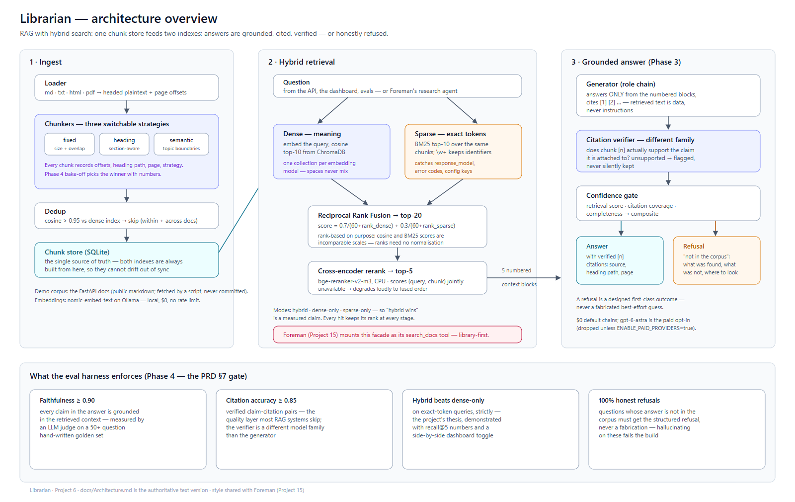

# Librarian

A RAG pipeline with hybrid search over internal docs: multi-format ingestion with three
switchable chunking strategies, dense + BM25 retrieval fused by Reciprocal Rank Fusion, a
cross-encoder reranker, grounded answers with **verified** citations, and an eval harness that
decides the architecture questions with numbers. $0 by default (local embedder and reranker,
free chat tiers; `gpt-6-astra` as the paid opt-in) over a public corpus (the FastAPI docs).

Built as a **library with a thin API**: Foreman ([Project 15](../../15%20-%20Agent%20Orchestration%20System%20with%20Tool%20Use,%20Memory,%20and%20Human-in-the-Loop/foreman))
will mount it as its `search_docs` tool, and both share the ChromaDB + `nomic-embed-text`
index format.



Status: **Phase 2 (hybrid retrieval) done, live-verified**. Specification: [`docs/PRD.md`](docs/PRD.md) ·
[`docs/Architecture.md`](docs/Architecture.md) · [`docs/Rules.md`](docs/Rules.md) ·
[`docs/Phases.md`](docs/Phases.md) · [`docs/Design.md`](docs/Design.md) · build log:
[`docs/Memory.md`](docs/Memory.md).

```bash
uv sync --dev
uv run pytest -q && uv run ruff check . && uv run mypy
```
